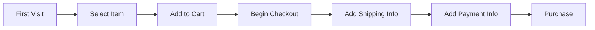

# 📊 Análisis de Embudo de Conversión y Retención de Usuarios — MercadoLibre (SQL Project)

## 📌 Descripción del Proyecto

En este proyecto se analiza el **embudo de conversión y la retención de usuarios** de una plataforma de e-commerce inspirada en MercadoLibre.

El objetivo es identificar **en qué etapa del proceso de compra se pierden más usuarios** y analizar **qué tan bien la plataforma retiene a los usuarios a lo largo del tiempo**.

El análisis se realizó utilizando **SQL**, aplicando técnicas de **CTEs, agregaciones, análisis de cohortes y métricas de conversión** para generar insights accionables para el equipo de producto.

---

# 🎯 Objetivos del Análisis

Este proyecto busca responder las siguientes preguntas de negocio:

### Embudo de conversión

* ¿Cuál es la tasa de conversión entre cada etapa del embudo?
* ¿En qué etapa ocurre la mayor pérdida de usuarios?
* ¿Cómo varía la conversión según:

  * país
  * tipo de dispositivo
  * fuente de tráfico?

### Retención de usuarios

* ¿Qué porcentaje de usuarios vuelve después de registrarse?
* ¿Cuál es la retención en:

  * D7
  * D14
  * D21
  * D28?
* ¿Cómo varía la retención entre países?

---

# 🧭 Embudo de Conversión Analizado

El análisis se basa en el siguiente **macro journey de usuario** dentro de la plataforma:

| Etapa                | Evento                             | Descripción                                |
| -------------------- | ---------------------------------- | ------------------------------------------ |
| Descubrimiento       | `first_visit`                      | Primera visita del usuario a la plataforma |
| Interés              | `select_item` / `select_promotion` | El usuario explora productos               |
| Intención de compra  | `add_to_cart`                      | El usuario añade un producto al carrito    |
| Inicio de compra     | `begin_checkout`                   | El usuario inicia el proceso de pago       |
| Información de envío | `add_shipping_info`                | Se agrega información de envío             |
| Información de pago  | `add_payment_info`                 | Se agrega método de pago                   |
| Conversión           | `purchase`                         | El usuario completa la compra              |

A partir de estos eventos se calcula:

* tasa de conversión por etapa
* caída de usuarios entre pasos
* conversión final del embudo

---

# 🗂 Dataset

El proyecto utiliza dos tablas principales.

## Tabla: `mercadolibre_funnel`

Contiene los **eventos del comportamiento de usuarios durante el proceso de compra**.

Columnas relevantes:

* `user_id` — identificador del usuario
* `session_id` — identificador de sesión
* `event_name` — evento realizado por el usuario
* `event_date` — fecha del evento
* `country` — país del usuario
* `device_category` — tipo de dispositivo (mobile, desktop, tablet)
* `platform` — sistema operativo o plataforma
* `product_cat` — categoría del producto
* `price` — precio del producto
* `referral_source` — fuente de tráfico (organic, paid_search, social)

---

## Tabla: `mercadolibre_retention`

Contiene información sobre **actividad de usuarios después del registro** para calcular retención.

Columnas relevantes:

* `user_id`
* `signup_date`
* `country`
* `device_category`
* `platform`
* `day_after_signup`
* `activity_date`
* `active`

Esta tabla permite construir **cohortes de retención**.

---

# 🔎 Metodología de Análisis

El análisis se realizó en varias etapas:

### 1️⃣ Exploración de datos

* validación de estructura de tablas
* identificación de eventos clave del embudo
* revisión de consistencia temporal

### 2️⃣ Construcción del embudo

Se creó un **embudo multi-etapa usando CTEs** para:

* contar usuarios por evento
* ordenar eventos cronológicamente
* calcular conversiones entre etapas

### 3️⃣ Cálculo de métricas

Se calcularon métricas como:

* tasa de conversión por etapa
* drop-off rate
* conversión total del embudo

### 4️⃣ Análisis de retención

Se construyeron **cohortes de usuarios** según su fecha de registro para calcular retención en:

* D7
* D14
* D21
* D28

### 5️⃣ Segmentación

El análisis se segmentó por:

* país
* dispositivo
* fuente de tráfico

---

# 🛠 Tecnologías Utilizadas

* **SQL**
* CTEs
* agregaciones (`COUNT`, `SUM`)
* análisis de cohortes
* cálculo de tasas de conversión
* análisis de comportamiento de usuarios

---

# 📁 Estructura del Repositorio

```
mercadolibre-funnel-analysis

data/
dataset_description.md

sql/
01_data_exploration.sql
02_funnel_analysis.sql
03_conversion_rates.sql
04_retention_cohorts.sql

README.md
```

---

# 📈 Principales Métricas Analizadas

### Conversión

* conversión entre cada etapa del funnel
* tasa de abandono por etapa
* conversión final a compra

### Retención

* retención por cohorte
* retención D7, D14, D21, D28
* comparación de retención entre países

---

# 💡 Impacto del Análisis

Este análisis permite al equipo de producto:

* detectar **cuellos de botella en el proceso de compra**
* identificar **etapas con mayor abandono**
* entender **comportamiento de usuarios por dispositivo o canal**
* evaluar **calidad de adquisición de usuarios mediante retención**

---

# 📚 Habilidades Demostradas

Este proyecto demuestra habilidades clave de **Data Analytics**:

* SQL avanzado
* análisis de embudos de conversión
* análisis de cohortes de retención
* análisis de comportamiento de usuarios
* interpretación de métricas de producto
* comunicación de insights de negocio


## Conversion Funnel


## 📑 Informe Ejecutivo

El informe completo con el análisis detallado y las recomendaciones de negocio puede consultarse en el siguiente documento:

📄 [Descargar informe ejecutivo](Proyecto 4_ Análisis de embudo y retención para MercadoLibre - Resumen ejecutivo - Informe Ejecutivo.pdf)

---

## 📊 Resumen Ejecutivo

Este proyecto analiza el **embudo de conversión y la retención de usuarios** de una plataforma de e-commerce inspirada en MercadoLibre entre el **1 de enero y el 31 de agosto de 2025**.

El objetivo del análisis fue identificar **en qué etapa del proceso de compra se pierden más usuarios** y evaluar **qué tan bien la plataforma logra retener a los usuarios a lo largo del tiempo**.

---

### Principales hallazgos del embudo de conversión

La mayor caída de usuarios ocurre entre **la interacción con el producto y el agregado al carrito**.

* **76.9%** de los usuarios interactúan con un producto.
* Solo **11.0%** lo agregan al carrito.
* Esto representa aproximadamente **un 86% de pérdida en esta etapa**.

Este resultado indica que el principal problema del embudo **no está en el checkout**, sino en la conversión del **interés en intención de compra real**.

#### Diferencias por país

Se identificaron tres comportamientos principales:

**Mercados con mayor conversión final**

* México → **2.48%**
* Uruguay → **4.55%**

**Países con mayor fuga en la etapa select_item → add_to_cart**

* Argentina → **1.25%**
* Brasil → **0.68%**
* Perú → **1.82%**

**Países con quiebres críticos en checkout**

* Paraguay
* Ecuador
* Colombia
  (en estos países no se registran compras en el período analizado)

---

### Hallazgos de retención de usuarios

Se analizó la retención de usuarios registrados entre **el 1 de enero y el 1 de junio de 2025**, evaluando su actividad en **D7, D14, D21 y D28**.

Retención general:

| Día | Retención |
| --- | --------- |
| D7  | ~86%      |
| D14 | ~55%      |
| D21 | ~25%      |
| D28 | ~2–3%     |

Los resultados muestran que la **activación inicial es alta**, pero la retención cae significativamente después de **D14**, lo que indica dificultades para mantener el engagement en el mediano plazo.

#### Retención por país (D28)

**Mayor retención**

* Perú → **3.2%**
* México → **3.1%**

**Retención media**

* Brasil
* Uruguay
* Bolivia
* Ecuador (~2.5%)

**Menor retención**

* Argentina → **1.8%**
* Chile → **1.7%**
* Colombia → **1.6%**

---

### Recomendaciones de negocio

A partir de los resultados del análisis se proponen las siguientes acciones:

**Mejorar la conversión entre interacción con producto y carrito**

* Optimizar la ficha de producto
* Mostrar el precio final con mayor claridad
* Anticipar costos de envío
* Realizar pruebas A/B en los botones de acción (CTA)

**Implementar estrategias diferenciadas por país**

Mercados con mejor conversión:

* Incrementar inversión en adquisición de usuarios
  (México, Uruguay)

Mercados con menor desempeño:

* Campañas de reactivación temprana (D7–D14)
* Incentivos después de la primera compra
* Educación sobre beneficios del ecosistema (pagos, envíos, protección al comprador)

---

### Reflexión del análisis

La etapa prioritaria para mejorar es **select_item → add_to_cart**, donde se pierde cerca del **86% de los usuarios que ya demostraron interés en un producto**.

Desde una perspectiva de impacto, pequeñas mejoras en esta etapa podrían generar un **efecto multiplicador en todo el embudo**, aumentando el número de usuarios que llegan al checkout y finalmente completan una compra.

El análisis también sugiere que los usuarios **exploran productos con frecuencia**, pero requieren **mayor claridad en precio, costos de envío y confianza en la plataforma** para completar la compra.

Además, aunque la activación inicial es alta, la plataforma enfrenta dificultades para **convertirse en un hábito de uso después de las primeras dos semanas** sin estímulos adicionales.


## Autor
Alejandra P

Proyecto desarrollado como parte de formación en **Data Analytics**.

Si te interesa discutir el análisis o colaborar en proyectos similares, puedes contactarme a través de GitHub o LinkedIn.

